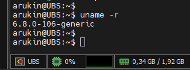
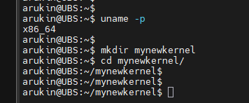
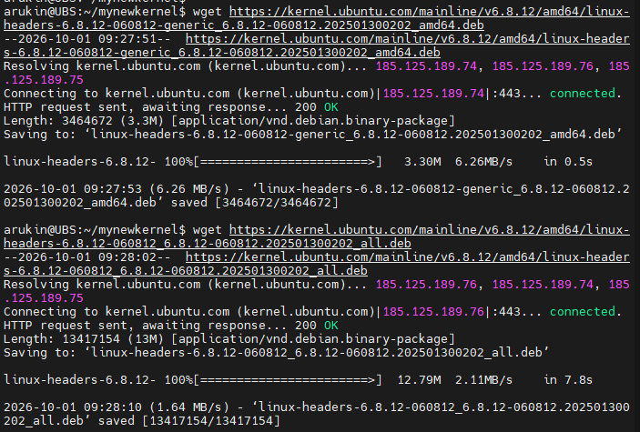
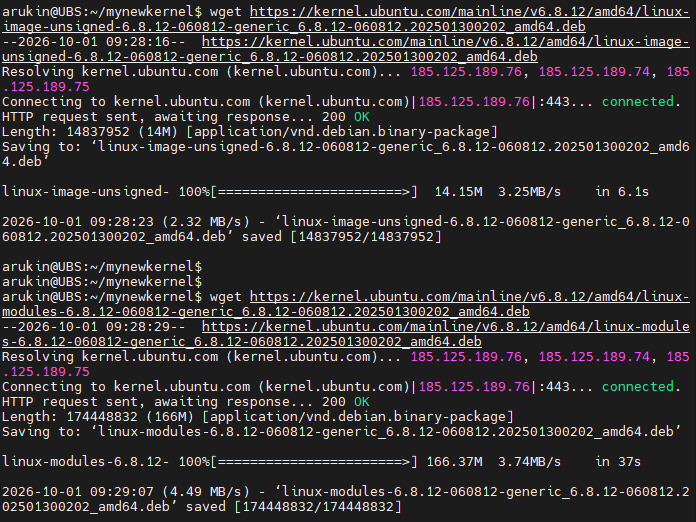
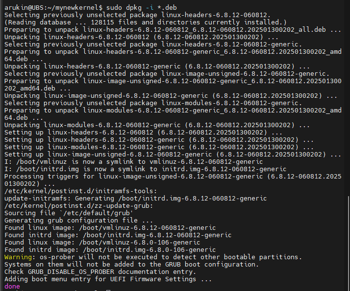
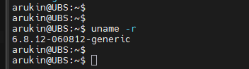

# Обновление ядра системы

###  Задание:

1. Запустите ВМ c Ubuntu.
2. Обновите ядро ОС на новейшую стабильную версию из mainline-репозитория.
3. Оформите отчет в README-файле в GitHub-репозитории.

###  Решение:

1. Подключаемся к ВМ Ubuntu и проверяем текущую версию ядра ОС

2. Определимся с архитектурой железа и создадим каталог mynewkernel для загрузки обновленной версии

3. Решил не выходить за рамки ядра 6.8, поэтому из репозитория https://kernel.ubuntu.com/mainline выбрал обновление 6.8.12

4. Устанавливаем все пакеты сразу

5. Перезагружаем ОС на новом ядре

На этом обновление ядра закончено.
